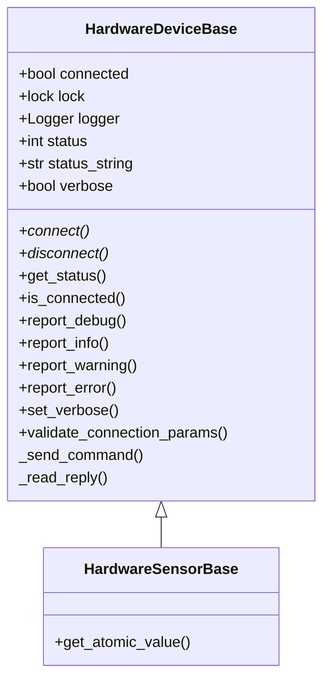

# Hardware Device Base Class
Base class for low-level hardware device modules.  It includes logging with a console logger and optional file logger.

HardwareDeviceBase

This class has these abstract methods:
   - connect(host, port)
   - disconnect()
   - get_atomic_value(item)
   - _send_command()
   - _read_reply()

This class also has these concrete methods:
   - validate_connection_params()
   - set_verbose()
   - is_connected()
   - _set_connected()

NOTE: The abstract methods must be implemented, but the concrete methods
can be used as is, or overridden.

See example_hardware_device.py for specific implementation examples.

