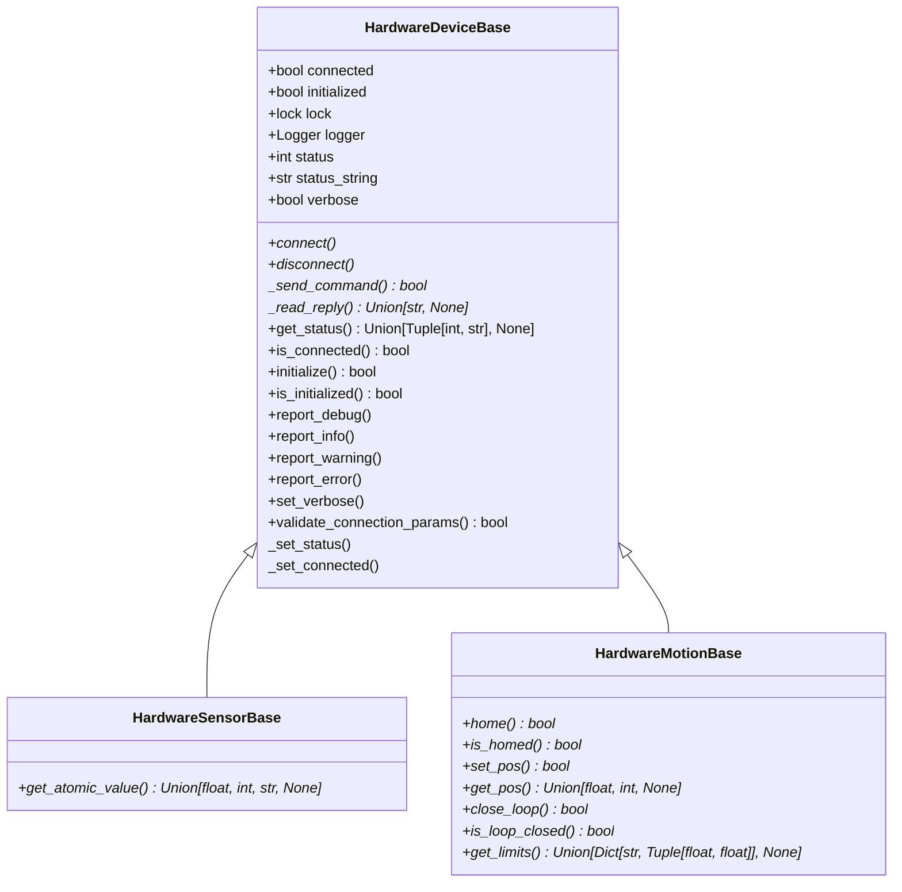

# Hardware Device Base Classes
Base classes for low-level hardware device modules.  The parent base class
includes logging with an optional console and file logger.  There is a child
base class for sensor devices and another for motion devices.

In the diagram below the methods in italics (with the *) are abstract while the
others are concrete.  Those that begin with a '+' are public while those that
begin with an underscore ,'_', are private.  Methods return None unless
otherwise indicated.

NOTE: The abstract methods must be implemented, but the concrete methods
can be used as is, or overridden.

See example_hardware_device.py for specific implementation examples.

